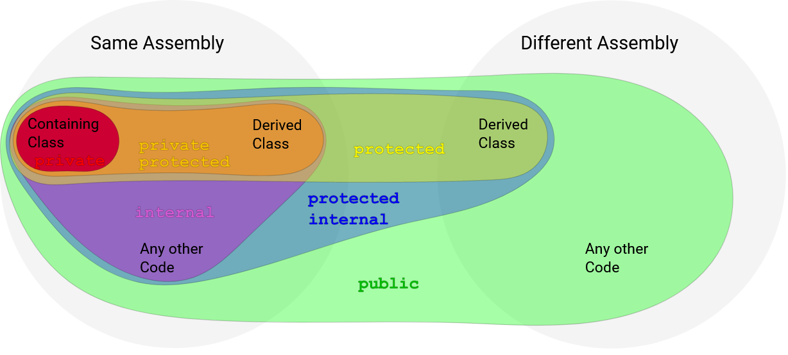

# CSharp Notes - 2021

Personal notes on C# programming language.
- [CSharp Notes - 2021](#csharp-notes---2021)
- [C-Sharp](#c-sharp)
  - [Core Features](#core-features)
- [To-Learn](#to-learn)
- [Learning Sites](#learning-sites)
  - [Design/Patterns](#designpatterns)
- [Readings](#readings)
- [General Notes](#general-notes)
- [Project Instructions](#project-instructions)
  - [.NET Console Application](#net-console-application)
    - [Commands](#commands)
- [Code Notes](#code-notes)
  - [Function-bodied expressions](#function-bodied-expressions)
  - [Overriding](#overriding)
- [Language Keywords, Concepts](#language-keywords-concepts)
  - [`abstract`](#abstract)
  - [Access Modifiers](#access-modifiers)
  - [Auto-properties](#auto-properties)
  - [Extension Methods](#extension-methods)
  - [`interface`](#interface)
  - [`namespace`](#namespace)
  - [`public`](#public)
  - [`static`](#static)
  - [`this`](#this)
  - [`virtual`](#virtual)
- [Books](#books)

# C-Sharp

## Core Features

- strong typing 
- object-oriented design
- multi-paradigm nature
# To-Learn

Focus on the core of the language.
- Learn:
  - basic syntax, program structure
  - different data types (primitive and other types)
  - how to construct a method, how to overload a method, how to extend a method, how to write a method with a specific return type, the operators, and then apply them in a small and simple project
- Learn:
  - a little bit of the .NET Framework at a time,
  - concepts of OOP, LINQ, FP, how to incorporate database types into your project (XML, JSON, SQL, ect), learn reflection,
  - I/O operations (reading/writing from/to files)
- OOP:
  - classes, objects, access modifiers, properties, interfaces, inheritance, implementation, polymorphism, and eventually learn the object-oriented design patterns.
- Advanced:
  - LINQ, Collections, Reflection, Generics, Extension Methods, Multi-threading, PLINQ (Parallel LINQ), asynchronous programming with async/await, expression trees, delegates, dynamics, events.

Learn more.

# Learning Sites

- https://refactoring.guru/design-patterns/csharp
- https://dotnettutorials.net/course/dot-net-design-patterns/ 
- https://www.kenneth-truyers.net/2016/02/02/vertical-slices-in-asp-net-mvc/ 

## Design/Patterns

- Repository Pattern and Unit of Work: [Link](https://dev.to/moe23/step-by-step-repository-pattern-and-unit-of-work-with-asp-net-core-5-3l92)


# Readings

- https://www.telerik.com/blogs/modern-tech-stack-for-asp-dotnet-apps
# General Notes

- Style: [Link](https://docs.microsoft.com/en-us/dotnet/csharp/fundamentals/coding-style/coding-conventions)

# Project Instructions

## .NET Console Application

- Creating: https://docs.microsoft.com/en-us/dotnet/core/tutorials/with-visual-studio-code
- Debugging: https://docs.microsoft.com/en-us/dotnet/core/tutorials/debugging-with-visual-studio-code

### Commands

```console
dotnet run
```

# Code Notes

## Function-bodied expressions

```csharp
public float Score { 
  get => throw new NotImplementedException(); 
  set => throw new NotImplementedException();
}
```

```csharp
public static float AverageThreeScores(float a, float b, float c) => (a + b + c) / 3;
```

## Overriding

```csharp
// And StringBuilder example
public override string SendMessage(string message)
{
    var original = base.SendMessage(message);
    var sb = new StringBuilder(original);
    sb.AppendLine("This message is private and confidential.");
    sb.AppendLine("(This is a new line.)");
    sb.Append("{This is appending a line.}");
    sb.AppendLine("[This is a new line again.]");
    return sb.ToString();
}
```

# Language Keywords, Concepts

## `abstract`
- Implementation is mandatory.
- Virtual method:
  - Implementation is optional.
  - They can be used as they are or they can do additional actions.

## Access Modifiers
- It enables "encapsulation".
- [StackOverflow ↗](https://stackoverflow.com/questions/614818/in-c-what-is-the-difference-between-public-private-protected-and-having-no)

| Keyword | Description |
| -- | -- |
| public | The type or member can be accessed by any other code in the same assembly or another assembly that refernces it. |
| private | The type or member can only be accessed by code in the same class or struct. |    | protected | The type or member can only be accessed by code in the same class or struct, or in a derived class. 
| private protected (added in C# 7.2) | The type or member can only be accessed by code in the same class or struct, or in a derived classfrom the same assembly, but not from another assembly. |
| internal | The type or member can be accessed by any code in the same assembly, but not from another assembly. |
| protected internal | The type or member can be accessed by any code in the same assembly, or by any derived class in another assembly. |


|  |
|:--:|
| *Schema.* |

If you struggle to remember the two-worded access modifiers, remember outside-inside:
- `private protected`: `private` outside (the same assembly), `protected` inside (same assembly).
- `protected internal`: `protected` outside (the same assembly), `internal` inside (same assembly).

## Auto-properties

- They can have logic in it.
```csharp
public class ScoreUtility {
  public string Name { get; set; }
}
```
Which is the same threading:
```csharp
public class Genre {
  private string name; // "backing field", contain the actual data.
  public string Name // This is the property.
  {
    get { return this.name; } // accesor, returns
    set { this.name = value; } // mutator, assigns

    // or

    get => name;
    set => name = value;
  }
}
```


## Extension Methods
- It allows to extend any class, and give to it new methods, without needing access to the source code and without subclassing.
- It has to be `static`.
- The `this` keyword allows to associate the extension class with whatever is extending, in this clase, with `string`.
```csharp
namespace SchoolLibrary
{
  public static class ExtensionMethods
  {
    public static int WordCount(this string str)
    {
      var wordCount = str.Split(
        new char[] { ' ', '.', '?' },
        StringSplitOptions.RemoveEmptyEntries
        ).Length;
      return wordCount;
    }
  }
}
```

## `interface`
- Set of behaviours.
- It allows to require a class to implement certain properties and methods signatures, under a same name.
- It acts as a contract between developers.
- They help to reduce overload methods.
- They work with abstract classes too.

```csharp
namespace SchoolLibrary
{
  public interface IScored
  {
    float Score { get; set; }
    float MaximumScore { get; set; }
  }
}
```

```csharp
namespace SchoolLibrary
{
  public class ScoreUtility
  {
    public static IScored BestOfTwo(IScored assignmentOne, IScored assignmentTwo)
    {
      var scoreOne = assignmentOne.Score / assignmentOne.MaximumScore;
      var scoreTwo = assignmentOne.Score / assignmentOne.MaximumScore;

      if(scoreOne > scoreTwo) {
          return assignmentOne;
      } else {
        return assignmentTwo;
      }
    }
  }
}
```


## `namespace`
- They are packages in Java.
- Used for avoiding "namespace collision".
## `public`
- 
## `static`

## `this`
- Current object.

## `virtual`

- It is used when we want to have an implementation and use it later ina subclass through an override.


# Books

- Microsoft Enterprise architecture,
- Clean code architectures and vertical slice
- clean code Domain driven design and vertical slice